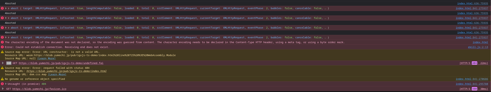

This is a minimal example of using IGV.js in TypeScript.

TypeScript has been widely adopted in the JavaScript community and it is a pain point to use igv.js currently in TypeScript b/c the lack of type definition files. This is a simple example and starting point of describing igv.js API to TypeScript.

When the definition is complete, it can be used in one of the following ways:

1. As a standalone type definition file users can include in their project.
2. Distributed together with igv.js to npm. (easiest for end users)
3. Submitted to DefinitelyTyped or other out-of-tree type definition repositories.

[src/index.ts](src/index.ts) is a purposefully badly written code that can barely stumble through the Javascript engine. I have annotated all the errors TypeScript caught in the code.

This is the errors generated on Firefox after running this code:



Not very helpful, isn't it?

Here are some examples of the errors TypeScript caught:

```
Object literal may only specify known properties, and 'oops' does not exist in type 'CreateOpt'.ts(2353)

Expected 0 arguments, but got 1.ts(2554)

Type 'number' is not assignable to type 'string'.ts(2322)
```

These are much more helpful.


To build the project, run:

```bash
npm install
npm run build
```

To start dev server, run:

```bash
npm install
npm run dev
```

then start a web server in the project root directory and open `index.html` in a browser.

Here's a hosted version of the demo:
[Try it out](https://blob.yumechi.jp/pub/igvjs-ts-demo/index.html)